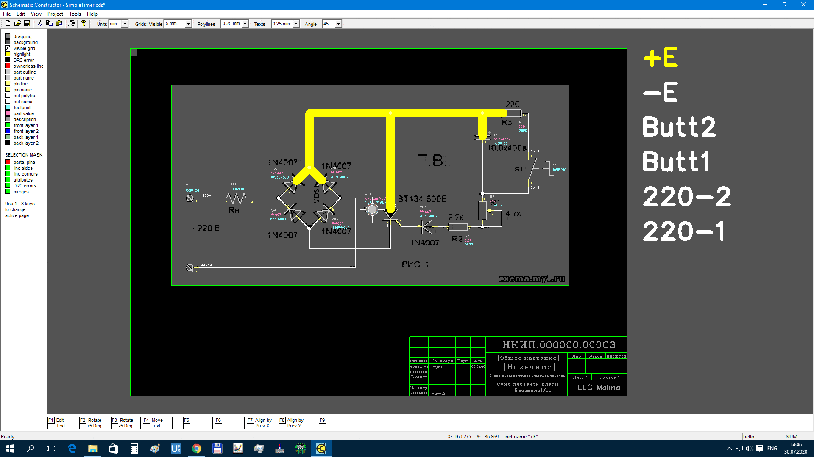

### `Schematic Constructor v1.0 (circuit design software)`

Program features:

* Support for multi-page schematic design

* Support for multi-graphic part symbols

* Export of netlist to PADS-PCB (supported by OrCad KiCad DipTrace Altium Eagle EasyEda, etc.)

* No component libraries required

* Ability to move part pins directly in the main schematic editor window.

* Importing a bitmap.

* Continuous numbering of parts

* Search for a part by attribute and import from adjacent projects

* Synchronizing attributes between pages

* DRC check

### `Philosophy`

The multi-page editor is designed to be able to quickly create small electronic circuits without any libraries. Using a simple tool - polylines, you can draw a schematic diagram and create a netlist.

With Schematic Constructor, you no longer need to create graphic symbol libraries. The program is designed in such a way that there is no graphic symbol editor. This has some advantages, for example you can rename and move part pins right in the workspace. The graphic symbol for the same part may differ from project to project. If in one project you use microcontroller pins, in another you do not use them, but use completely different pins, then there is no need to save a graphic element to the library for each circuit. When you create a project for the first time, you draw the details of that project. Then, creating a second project, you can import parts from previous schematic projects created earlier in the Schematic Constructor into it. The program will search for a part by name or another attribute that you specify in the dialog box, and after finding this component will insert it into your current project. This way you don't have to go through the projects to find a part, but you should keep the project folders in one shared folder.

Special attention should be paid to the topic of hidden text in the schematic design. You should avoid hidden texts in the project, because they are not displayed when printing the diagram on paper, therefore it can lead to errors. Initially, the idea was to make it impossible to hide text attributes, such as the name of the footprint, or the name of the pin, but when using the editor in practice, this turned out to be a serious limitation, and this idea had to be abandoned. But on the other hand, an option was added to search for hidden footprint attributes to control them.

### `Подключение к Freepcb`

`Schematic Constructor` и `Freepcb-2` - самодостаточное ПО, они могут быть использованы отдельно друг от друга. Это означает что начертив схему в `Schematic Constructor`, печатную плату вы можете проектировать в другой среде, которая поддерживает импорт PADS-PCB netlist (например KiCad). Но если вы выберите FreePcb-2, то у вас будет преимущество, в виде напоминаний когда вы внесете изменения в схему, чтобы вы не забыли импортировать эти изменения в печатную плату. Связь между схемным редактором и редактором печатных плат осуществляется посредством экспорта нетлиста из `Schematic Constructor`, и импорта нетлиста в `Freepcb-2`. Электрическая схема является первоисточником, поэтому если после импорта нетлиста вы захотите модифицировать проект (добавить/удалить детали на печатной плате), то вы должны начать со схемы. Это может показаться неким ограничением возможностей, но такой способ редактирования является классическим и помогает избежать ошибок в отличии от варианта когда вы сначала вносите изменения в печатную плату, а затем в схему.

### `Для кого`

`Schematic Constructor` идеален для небольших проектов. На данный момент редактор поддерживает 8 страниц, которые могут быть связанными (сквозная нумерация деталей) или автономными (когда допускается дублирование RefDes между страницами). Затем вы можете экспортировать эти страницы в ПДФ-файл. Ориентация страниц в ПДФ-файле выбирается автоматически в соответствии с ориентацией схемы (Обычно схема по оси Y меньше чем по оси X - это альбомная ориентация). Количество страниц может быть расширено в будущем. 

Программа оснащена автоматической проверкой правил дизайна перед созданием нетлиста. Проверка дизайна на наличие ошибок делится на 2 этапа. Сначала проверяются сети на наличие контакта и другие ошибки во время генерации сетей, а затем проверяются имена деталей и пинов с помощью диалогового окна DRC в котором также существует контроль клиренсов текстов на полилинии.
На выходе вы получаете нетлист, BOM-файл и список деталей. 

Отдел поддержки:

Если у вас есть вопрос или предложение связанное с `Schematic Constructor` , то не забудьте написать на почту duxah@yahoo.com

### `Лицензия`

`Schematic Constructor` распространяется под лицензией FreeWare и находится в открытом доступе. (бесплатно для частных лиц и организаций)

### [`Пожертвовать на развитие`](https://paypal.me/freepcb2)

Вы можете сделать пожертвования в фонд ресурса freepcb.dev. Вы можете внести любую сумму денежных средств оценив вашу прибыль и долю участия `Schematic Constructor` или `freepcb-2` в вашем бизнесе. Или можете пожертвовать не деньгами а другими благами, например разместить ссылку на вашем сайте, или снять видеоинструкцию к программам. Это все считается пожертвованием. 

Домен не является бесплатным. Ваши пожертвования идут для поддержки freepcb.dev.

`Презентация намечена на 25.08.2020`

