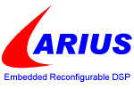

<link rel="shortcut icon" type="image/png" href="https://github.com/Duxah/FreePCB-2/blob/master/pictures/favicon.png?raw=true">

***

_Warning! This document has been translated into English from another language. The author is not responsible for the inaccuracy of the translation, if any._

***

### `Introduction`

* 1 to 16 copper layers
* Board size up to 60 inches by 60 inches
* Uses English or metric units (i.e. mils or mm) for most functions.
* Footprint Wizard and Footprint Editor for creating or modifying footprints
* Import and automatic export of PADS-PCB lists when saving file
* Import and export to mechanical format DXF
* Import and export Pcad ASCII files (is maintained by Altium)
* Exports extended Gerber files (RS274X) and Excellon drill files
* Design rule checker
* Autosave

### `Window view`

***
### `About FreePCB-2`

FreePcb is a unique PCB design program with a function key interface. Version 2.0 presented on this site is a fork of version [1.359](http://freepcb.com), taken for revision in 2014. FreePcb-2 contains new features not available in version 1.359 and provides more freedom for circuit board developers. If you don’t want to waste your time mastering complex PCB design applications, download FreePcb-2, which can do a lot of what CADs can do, but is easy to learn and takes up little disk space on your computer. FreePcb-2 does not have a huge number of buttons as in other CAD systems, the purpose of which is not immediately clear. There are only 9 buttons (F1 ... F9), the Functions of which change depending on the type of the selected element (part, vertex of trace, segment and etc.), so FreePcb-2 can be studied even without instructions. There is also a right-click context menu with additional features. 

***
### [`Schematic Constructor`](https://freepcb.dev/ECDS.html)

In FreePcb, you can create a netlist manually by adding parts and then connecting their pins. But you can also import a netlist in the PADS-PCB popular format from FreePCB2 compatible Schematic Editor. See description on [this page](https://freepcb.dev/ECDS.html)

***
### `Uploading Gerber files`

If at least one of the following programs is installed on your computer:

* **ViewMate** 

* **GerberLogix** 

 

* **Gerbv (GEDA's Gerber Viewer)**

You will be able to upload gerber files into it for viewing, using the menu command directly from the FreePcb-2 window. (available from November 26, 2019)

Put a shortcut to the viewer in the "Shortcut" folder, which is provided in the root directory of Freepcb2, and then this item will appear in the main File menu.

***
### `Advantages`
1. accessibility (it does not have a limit on the number of pins, footprint libraries or any other parameters),
2. ease of learning (see useful links),
3. reduction of time for the development of printed circuit boards (A distinctive feature of FreePcb and FreePcb-2 from other PCB-editors is an interface using function keys, which speeds up the process of editing a printed circuit board for an experienced user),
4. saving computer memory (takes ~ 50MB hard drive),
but at the same time includes almost all the tools needed for professional use. 

***
### `Latest improvements`

`FreePcb-2.3:`

none

`Schematic Constructor-1.3:`

* Added a page comparison option to the PROJECT menu. The two pages can be compared and then the differences in the partlists and netlists are shown. Double click on the list allows you to jump to the object

* Option to add standard objects using a frame with the mouse. You can quickly draw the following shapes:

1) Rectangle (F1 button)
2) Square (F2 button)
3) Circle (F3 button)
4) Oval (F5 button)
5) Ellipse (F6 button)
6) Rounded rectangle (F7 key)
7) Cloud (F8 button)

To activate this menu press F3 (Add polyline) or F4 (Repeat polyline) 

* Schematic Constructor 1.3 can read the names of footprints of other PCB editors (in particular, P-cad). If you are using the Schematic Constructor, but for some reason do not want to use FreePcb2 to route printed circuit boards, then you can specify the path to the library of your CAD system so that the Schematic Constructor downloads footprint names for itself and then suggests them in the drop-down list.

***

 

### [Download](Download.md)
### 

 If you like, post [this](pictures/logo.png) picture on your website. Have fun using FreePcb-2.

You can participate in the improvement of the application. Feel free to write a message regarding working with FREEPCB2 so that we can release the official version FreePcb2.3 & Schematic Constructor 1.3 as soon as possible. Working together is always more efficient.

***
### `Partners`

 
 )
 
 )
 
 )
 

_[to learn more...](partners.md)_

***
### `Contacts`

* [User forum](https://groups.io/g/freepcb) You can use the forum of the first official version of FreePcb, which has now been ported to groups.io, and ask your question there. 
* If you have any suggestions related to FreePcb-2 or you do not want to submit your question for public review, send to email duxah@yahoo.com.
* If you want to improve the translation of this document, please send your file by email
* If you have your own libraries of footprints that you are ready to share with everyone, then you can send them to me, and I'll post them on the site.
* FreePcb-2 is involved in the development of industrial appliances and has been thoroughly tested to prevent errors. But if you find an error, please send me a report by e-mail with a description and screenshots so that I can fix it as soon as possible.

***
### `Useful links`

1. [License](LICENSE)
2. [FreePcb user guide 1-359](https://github.com/Duxah/FreePCB-2/raw/master/FreePcb-2/bin/doc/freepcb_user_guide.pdf)
3. [FreePcb-2 "How to.." guide 2020](/How_to.md)
4. [How to make a schematic design](/How_to_cd.md)
5. [About this development fork](/About_development.md)
6. [For software developers](developers.md)

***
### [`Get started with FreePcb-2`](/How_to.md)

The text of this site is a translation from foreign language using Google inc. ©2019-2021
