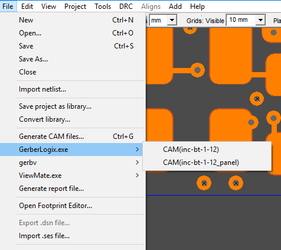
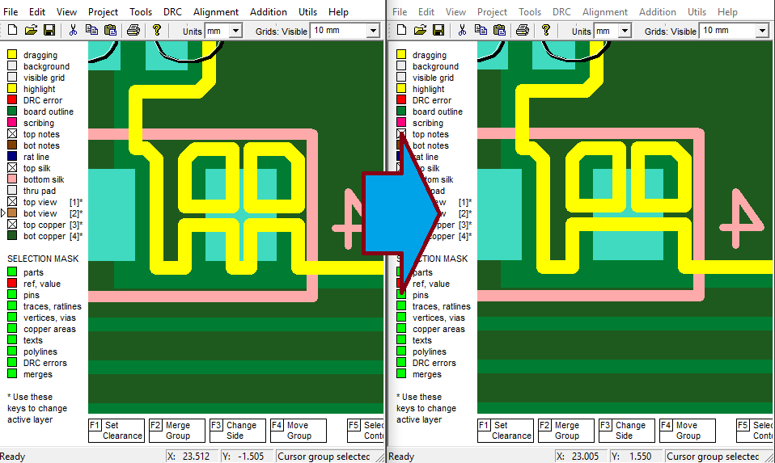

<link rel="shortcut icon" type="image/png" href="https://github.com/Duxah/FreePCB-2/blob/master/pictures/favicon.png?raw=true">

***

_This document has been translated into English from another language (the author is not responsible for the inaccuracy of the translation, if any)_

***

### `Introduction`

* 1 to 16 copper layers
* Board size up to 60 inches by 60 inches
* Uses English or metric units (i.e. mils or mm) for most functions
* Schematic editor included
* Footprint Wizard and Footprint Editor for creating or modifying footprints
* Import and automatic export of PADS-PCB lists when saving file
* Import and export to mechanical format DXF
* Import and export Pcad ASCII files (is maintained by Altium)
* Exports extended Gerber files (RS274X) and Excellon drill files
* Design rule checker
* Autosave (all software versions have autosave of the current file to the root folder \ AUTOSAVE with a frequency of 1.5 minutes)

***

### `Window view`

***
### `About FreePCB-2`

FreePcb is a unique PCB design program with a function key interface. Version 2.0 presented on this site is a fork of version [1.359](http://freepcb.com), taken for revision in 2014. FreePcb-2 contains new features not available in version 1.359 and provides more freedom for circuit board developers. If you don’t want to waste your time mastering complex PCB design applications, download FreePcb-2, which can do a lot of what CADs can do, but is easy to learn and takes up little disk space on your computer. FreePcb-2 does not have a huge number of buttons as in other CAD systems, the purpose of which is not immediately clear. There are only 9 buttons (F1 ... F9), the Functions of which change depending on the type of the selected element (part, vertex of trace, segment and etc.), so FreePcb-2 can be studied even without instructions. There is also a right-click context menu with additional features. 

***
### [`Schematic Constructor`](https://freepcb.dev/ECDS.html)

In FreePcb, you can create a netlist manually by adding parts and then connecting their pins. But you can also import a netlist in the PADS-PCB popular format from FreePCB2 compatible Schematic Editor. See description on [this page](https://freepcb.dev/ECDS.html)

***
### `Uploading Gerber files`

If at least one of the following programs is installed on your computer:

* **ViewMate** 

* **GerberLogix** 

 

* **Gerbv (GEDA's Gerber Viewer)**

You will be able to upload gerber files into it for viewing, using the menu command directly from the FreePcb-2 window. (available from November 26, 2019)

Put a shortcut to the viewer in the "Shortcut" folder, which is provided in the root directory of Freepcb2, and then this item will appear in the main File menu.

***
### `Advantages`
1. accessibility (it does not have a limit on the number of pins, footprint libraries or any other parameters),
2. ease of learning (see useful links),
3. reduction of time for the development of printed circuit boards (A distinctive feature of FreePcb and FreePcb-2 from other PCB-editors is an interface using function keys, which speeds up the process of editing a printed circuit board for an experienced user),
4. saving computer memory (takes ~ 50MB hard drive),
but at the same time includes almost all the tools needed for professional use. 

***
### `Latest improvements`

`FreePcb-2.3.14:`

* Improved display of the merge name

* Open the PCB file and from the PCB editor switch to the schematic editor by selecting the "View-> Switch To PCB" menu. Now in the PCB editor, when you hover the mouse cursor over a pin, the same pin is highlighted in the schematic 

* The outline line is always shown as a solid fill in the color of the "Board Outline" layer for visual convenience

* Added "Protection" option to the "Project" menu. This can be useful after the design and order of the printed circuit boards from the factory has been completed. By enabling protection, you will not be able to edit the file 

* The netlist generated from the schematic editor is automatically loaded in the PCB editor by clicking the YES button 

* In the footprint of a part, you can place a cutout in the board. Wherever you move the part, the cut will move with it. Press F1 to add a cut

* The solder mask on the pins is displayed in Transparent mode

* Automatic alignment to ratlines. When positioning, the pins of different parts connected to each other are almost always located on the same axis - horizontal or vertical. for example, when we put a capacitor near the microcontroller leg. Previously, to align, you had to use the Alignment menu or press the Align softkey. Now this happens automatically if the ratline offset is less than the grid spacing. Select a sufficiently large Placement grid at the top of the window - for example 0.5mm to see how this function works. And if you do not want to use this function, then select a smaller grid step, or temporarily turn off the visibility of the Ratlines layer

* If you want to make all layers visible, then you can do it by pressing a single button on the keyboard: [~] it is located next to the [1] button. Click again to restore the previous visibility of the layers. If your project contains more than 2 layers, then press this button a third time, and only the inner layers will be shown. 

`Schematic Constructor-1.3.13:`

* Added a page comparison option to the PROJECT menu. The partlists and netlists on similar pages can be compared and then the differences can be displayed in the listbox. Double click on the list allows you to jump to the object. Double click on the list allows you to jump to the object

* Option to add standard objects using a frame with the mouse. To activate this menu press F3 (Add polyline) or F4 (Repeat polyline). You can quickly draw the following shapes:

1) Rectangle (F1 button)

2) Square (F2 button)

3) Circle (F3 button)

4) Oval (F5 button)

5) Ellipse (F6 button)

6) Rounded rectangle (F7 key)

7) Cloud (F8 button)

* Schematic Constructor 1.3 can read the names of footprints of other PCB editors (in particular, P-cad). If you are using the Schematic Constructor, but for some reason do not want to use FreePcb2 to route printed circuit boards, then you can specify the path to the library of your CAD system so that the Schematic Constructor downloads footprint names for itself and then suggests them in the drop-down list.

* Improved polyline properties editing menu. Select the side of the polyline and press F7 (Polyline properties). You can change the color of the polygon fill and make it lighter in relation to the color of the polyline itself (from 3% to 70% of the main tone). This option also works when exporting to PDF.

* The "Select" item and the "Unselect" item have been added to the main menu "Editing". Thus, you can select only polylines or only attributes, etc., in order to then edit the properties of a group of objects (for example change the text size or the polyline width)

* Added menu item "Open from project folder" to the "File" menu. This is a tree menu that allows you to directly open files from the project folder, bypassing the standard file dialog box 

* Improved "Magnet" function that helps when drawing connections between pins. The magnet works when the cursor approaches not only the vertex of the polyline but also its side

* Added "Protection" option to the "Project" menu. By enabling protection, you will not be able to edit the file 

* You can create project branches with index increments in filenames whenever you want to make new changes to a completed project. The branch folder will appear next to the project folder. This option automatically changes all texts that match the file name (increments the index) inside the new schematic and PCB file, so as not to do it manually. This "Item" is in the Project menu

* Lines style grid is displayed in Transparent mode 

* Improved import of parts from another project. You can check the "import with default polylines width" checkbox. In this case, the width of the polylines for the part will always be the same, as specified in the project options. And another super useful improvement is that if the pattern of the imported part is already present in the current project, then it is replaced from the local library

* Added "Component Description" item to the right-click menu on the part. The program can create a text file or a PDF file to store any information about a component (a component is for example "10MOhm @ 0805"). You can also attach an existing Datasheet of this part

* When there are many different netmarks in the project, you can quickly duplicate the netmark by selecting it by net name. The panel with label names is located on the left of the main window (under the selection mask). To activate this panel, right-click on any polyline with the network name attribute and select the "Add to favorites" menu

* You can see the pin list of any part. For example, if in your project you drew a microcontroller that, say, has 20 pins, but the maximum number in the pin names, say 30, then the program will display a list of 30 pins of which some will have the status "not connected" or "missing" ... (Right-click menu on any part, then "Get Pin List") 

* It is possible to hide all images attached to polylines. The picture will remain attached to the polyline, but will not be displayed on the display

* The dialog box for importing parts from other projects (F1 - Import Part) loads three attributes of the used parts - Value, Footprint and RefDes, so that you can find the part by prefix. For example, filter out in the list only capacitors (C) or resistors (R), etc. (before that there were only two attributes - Value and Footprint)

***

 

### [Download](Download.md)
### 

 If you like, post [this](pictures/logo.png) picture on your website. Have fun using FreePcb-2.

You can participate in the improvement of the application. Feel free to write a message regarding working with FREEPCB2 so that we can release the official version FreePcb2.3 & Schematic Constructor 1.3 as soon as possible. Working together is always more efficient.

***
### `Partners`

 )
 )
 )
 )
 )
 )
 

_[to learn more...](partners.md)_

***
### `Contacts`

* You can use the [forum of the first official version of FreePcb](https://groups.io/g/freepcb), which has been moved to groups.io since 2020, or write to the developer of this software fork - share your idea or report a bug to duxah@yahoo.com
* If you have your own libraries of footprints that you are ready to share with everyone, please send your file by email

***
### `Useful links`

1. [License](LICENSE)
2. [FreePcb user guide 1-359](https://freepcb.dev/FreePcb-2/bin/doc/freepcb_user_guide.pdf)
3. [FreePcb-2 "How to.." guide 2020](/How_to.md)
4. [How to make a schematic design](/How_to_cd.md)
5. [NEW! Translating the schematic editor's manual into English and Spanish](Translated.md)
6. [About this development fork](/About_development.md)
7. [For software developers](developers.md)
8. [Actual tasks](tasks.md)

***
### [`Get started with FreePcb-2`](/How_to.md)

*The text of this site is a translation from foreign language using Google inc. ©2019-2021
If you want to improve the translation of this content, please send your file by email*
