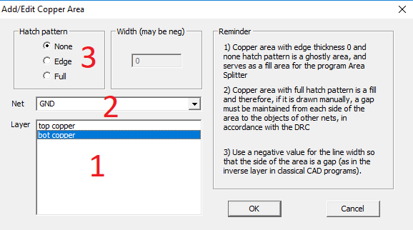

## How to add copper area

In mode nont selected press the F2 button, and then in the dialog that opens, select:
1) Copper area layer
2) Net
3) hatch pattern

Click OK to start dragging. To complete, right-click. 

### `Area types`

There are 3 types of copper areas in FreePcb-2:

1) Copper fill. In the gerber file this area will be drawn using lines as in many CAD systems. On the monitor screen you can see all the clearance to different nets. To select this type of area just check the box next to `Full` (Hatch pattern)

2) The ghostly copper region. It does not get into gerber files, does not interact with objects in the project. The ghost area is used exclusively to create a copper fill (the first type polygon) using the Areas.exe application. To select this type of polygon just check the box next to the `None` (Hatch pattern) and select the side width = 0. [How to fill the copper area?](pour_area.md)

3) Vector copper area. In the gerber file it's given by the vertices of the polygon. On the monitor screen, clearance to different networks is not displayed. The clearance is set in the CAM dialog (called copper fill clearance) and is automatically generated at the stage of creating gerber files. This type of copper area is convenient to use in the inner layers of the circuit board. You can also use a negative value of the width of the side of the copper region, in which case the side of the polygon will become the clearance for other similar polygons. In the menu `DRC-> check copper areas`, it is possible to check such polygons for breaking. Despite this, I recommend viewing gerber files if you use this type of copper area in your project. To add such an area, select `Edge` (Hatch pattern) or` None` + non-zero side width.

