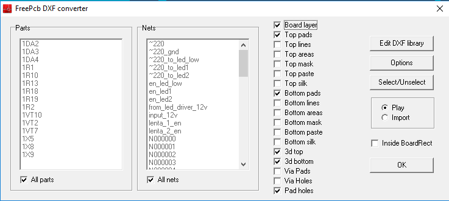
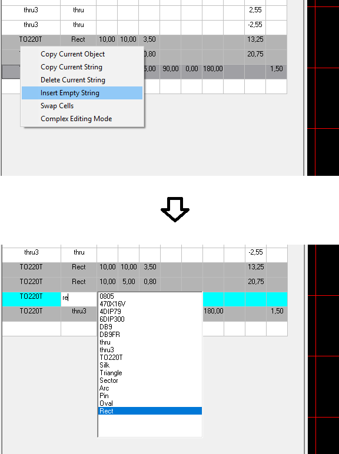
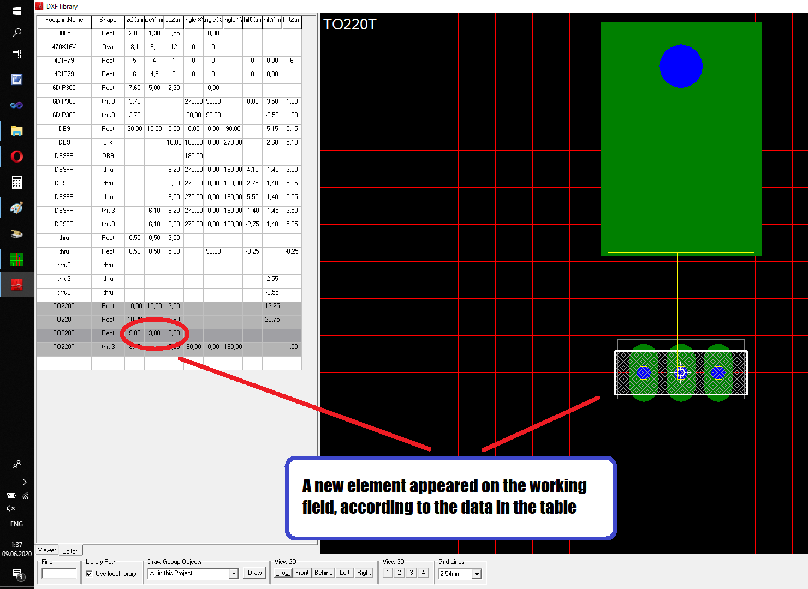
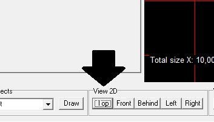

### Export to DXF file

The Infobox menu contains an application that converts the `* .fpc` file to the `* .dxf` mechanical format. Open the circuit board project dxf_export.fpc which is located in the "examples" folder. Select `Export->DXF` from the Infobox right-click menu. In `FreePcb-2-032`, the program window looks like this:

If you want to export copper tracks, pads, or circuit boards, simply select the checkboxes in the corresponding checkboxes and click OK. The file will be created in a separate folder in the same directory as the original `* .fpc` file.
In addition to simply exporting to a flat drawing, this program is able to export volumetric primitives, such as a rectangle, a triangle, an oval, extruded along the Z axis. These shapes are attached to the footprint of the part and you get something like a library of cases that is saved in the directory with the executable file: `..\ FPC_EXE \ FreePcb_ExportDXF \ dxf_lib.csv`
To browse \ edit the library of 3d cases, click the Edit DXF library button. A new window will appear:

Switch to the editor with the button in the lower left corner of the window. In editor mode, on the left side of the window is a table in which the parameters of the primitive are recorded

To make an overview of all the details in the project, click the Draw button, which is located at the bottom of the program window. By default, this button draws on the screen all the enclosures that are present in the project. To start editing a specific part, simply click on its drawing with the left mouse button. In the table, in each line of which the parameters of the figure that you want to display in the DXF file are set, as well as the binding of this figure to the part on the circuit board. The leftmost column is this binding to the figure, that is, the text in the first column is nothing more than the Package attribute of the part, which you can view / change in the FreePcb-2 part properties dialog box. It is important to remember that those parts that do not have the Package attribute will not be displayed here.

In the second column, you specify the shape of the figure. It can be:

* Rect
* Oval
* Triangle
* Sector
* Pin
* Arc
* Silk

3-5 columns of the table specify the size of X, Y, Z, respectively. You can click on this cell and use the mouse wheel to change the value of this size. If you hold down SHIFT, then resizing will occur in larger steps.

6-8 columns specify the angle of rotation of the figure in the planes XY, XZ, YZ, respectively. It is also convenient to use the mouse wheel to change this parameter.

9-11 specify the displacement of the figure along the axes X, Y, Z, respectively. The initial position of the figure 0, 0, 0 relative to the coordinates of the footprint. You can specify the offset in these cells by entering numerical values, and the figure moves to the specified number along the corresponding axis. The second way to move the figure is to click on the edge of the figure to select it, and then use the arrows on the keyboard to move it.

### `How to add a new shape to the table.`

Click on the first column of the TO220 package or any other package, it doesn’t matter. From the right-click menu, select Insert empty string, as shown in the figure. 

A new line will appear in which only the first cell will be filled in which the same package name will already be indicated. This means that the new figure will belong to the same package (TO220T). (In principle, you can change the name of the package, and then the new figure will belong to another package.) Next, in the second column, specify the name of the figure, for example, RECT. Click on 3, 4, 5 cells and use the mouse wheel to set the desired size of the X, Y, Z shape. The result should be something like this:

### `How to move a figure along the axis X, Y, Z.`

To move a shape along the X or Y axes, first click the TOP button in the bottom toolbar to make a top view. 

Now, using the arrows on the keyboard, you can move an element - left or right (X axis), up or down (Y axis)

To move a shape along the Z axis, first press the FRONT or BEHIND button to make a view from the end of the circuit board. Now, using the up or down arrows, you can move the shape. Either press the LEFT or RIGHT button and then use the left or right arrows.

### `Group movement.`

If you have created in this way several figures tied to one package and want to move all the elements at the same time, then check the Complex editing checkbox in the right-click menu on the table. Now moving the item will move all the items in the package.
After editing, close the editor window and click OK in the main window to generate the DXF file

