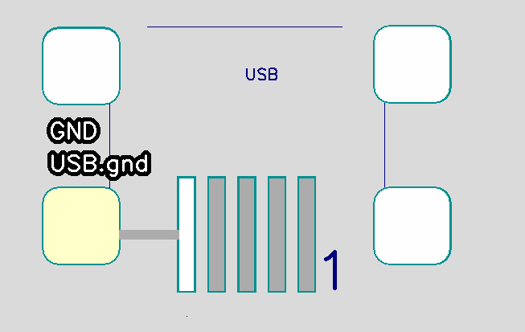

## Multiple pin

Some parts, for example, a mini-USB connector, have several PCB mounting pins connected inside the part, so in such cases it is necessary for the PCB application to understand that it is enough to connect at least one of the pins to ensure electrical connection. To do this, FreePCB-2 provides the ability to create a single pin with many pads (not in contact with each other). To create a multipin, just give the pins the same name.

In the footprint 4 large pads are called gnd and belong to the GND net

When you connect one pad of multiple-pin to any net, then other pads will also belong to this net.

When routing copper tracks, it will be enough to route the track to only one of the pads

***

If the program for recalculating the ratlines connects the wrong pad that you want to route, then you must create a connection to the desired pad yourself and immediately block this new connection:

1) Select the pad from which you want to route the copper trace.
2) Click press F2 (Connect_To_Pin button)
3) Select the pad to which you want to lead the copper trace. If these pads were not connected to the net, then a dialog box for choosing a new net name will appear. Enter a name and press OK.
4) Highlight this new connection that has appeared
5) Press F3 (Lock_Connect)

Now this connection is blocked and will not disappear anywhere when recalculating ratlines

