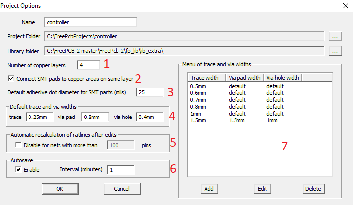

Click on the main menu FILE-> NEW

In this dialog box, you must first select the path to the project folder and to the folder with footprint libraries, and then enter the name of the project in the top line.

### You must also specify:

1) Number of copper PCB layers
2) `Connect SMT pads to the copper area.` This property refers to copper areas with a NONE or EDGE drawing style. If the checkbox is removed, then the pad located inside the area will not be in contact with the area, the connection must be made manually using a copper trace.
3) If your PCB installer uses an adhesive, select the appropriate size. (if you do not know then set the default size to 25 miles)
4) This size will be used when tracing the circuit board, unless individual network parameters are specified. (this field must be filled)
5) if the project is large so that the computer does not slow down it is better to limit to 100 pins. And for recalculation of bulky networks use the `F9-button` [Recalc / ratlines]
6) Autosave is strongly recommended. The files will be stored in the AUTOSAVE folder, you can always restore them in case of force majeure.
7) In this block, you must specify all the dimensions of the segments of the copper tracks and vias to be used in the project. After the parameter value, you need to specify the unit of measurement, as shown in the figure. If you leave the size field empty, the default value set in item 4) will be used.

# [return](How_to.md)
